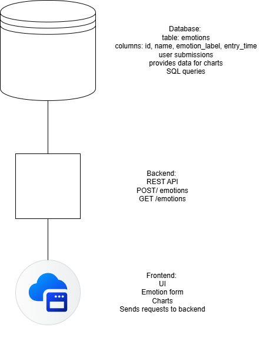
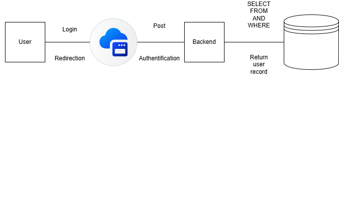

## Introduction

This backend server handles storing and serving user-submitted emotions. It receives emotion data via HTTP requests, saves it, and provides endpoints for the frontend to fetch emotion statistics. The server counts how often each emotion occurs and returns this data in a format suitable for charts and tables. Built with Node.js and Express, it runs on port 3001 by default and can be run in development mode with automatic restarts or in production mode.

## Commands

npm install

Installs all project dependencies (e.g., express, cors, axios).

Does not start the server.

2. npm run dev

Starts the backend server in development mode.

Typically uses nodemon to automatically restart on file changes.

Default port: 3001 (matches your frontend Axios requests).

Example URL: http://localhost:3001/emotions

3. npm run start

Starts the backend server in production mode.

Runs the already written JS files (or transpiled files if using TypeScript).

Default port: 3001

URL: http://localhost:3001/emotions

4. npm run build

Usually not needed for Node.js backend unless using TypeScript.

If using TypeScript, this command transpiles .ts files into .js.

## Component diagram

## Sequence diagram
